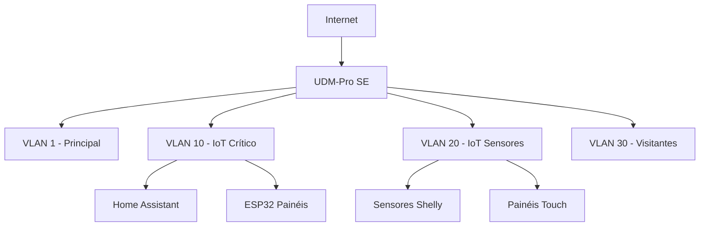

# Diagrama de Rede - Projeto Guilas

## 📝 GUIA PARA IA FUTURA

Este arquivo deve conter o diagrama completo da infraestrutura de rede.

### O que incluir:
1. **Topologia Geral**
   - Internet → UDM-Pro SE → Switch → Dispositivos
   - APs Unifi U7 (posições na casa)
   - Servidor Proxmox (Mini-PC)
   - Storage UGREEN

2. **VLANs** (conforme PROJECT-CONTEXT.md)
   - VLAN 1 (Principal): Tablets, celulares, computadores
   - VLAN 10 (IoT Crítico): ESP32s painéis Ethernet, Home Assistant
   - VLAN 20 (IoT Sensores): Sensores Shelly, painéis touch WiFi
   - VLAN 30 (Visitantes): Guest WiFi

3. **Endereçamento IP**
   ```
   VLAN 1: 192.168.1.0/24
   VLAN 10: 192.168.10.0/24
   VLAN 20: 192.168.20.0/24
   VLAN 30: 192.168.30.0/24
   ```

4. **IPs Estáticos Importantes**
   ```
   192.168.10.1  - UDM-Pro SE
   192.168.10.10 - Home Assistant (VM)
   192.168.10.101 - ESP32 Painel Térreo
   192.168.10.102 - ESP32 Painel Superior
   [... etc]
   ```

5. **DNS Local** (Unifi DNS)
   ```
   homeassistant.local → 192.168.10.10
   esp-painel-terreo.local → 192.168.10.101
   [... etc]
   ```

6. **Regras de Firewall**
   - VLAN 20 (sensores) não pode acessar VLAN 1 (principal)
   - VLAN 10 (crítico) pode acessar todas VLANs
   - VLAN 30 (guest) isolada (apenas internet)

7. **Backup/Monitoramento**
   - Tailscale VPN para acesso remoto
   - Uptime Kuma monitorando dispositivos

### Ferramenta recomendada para diagrama:
- draw.io (exportar PNG/SVG e salvar em `/imagens/`)
- Mermaid (diagrama em texto no próprio markdown)

### Exemplo Mermaid:


---

**Status**: 🔴 Aguardando criação após definir IPs exatos

